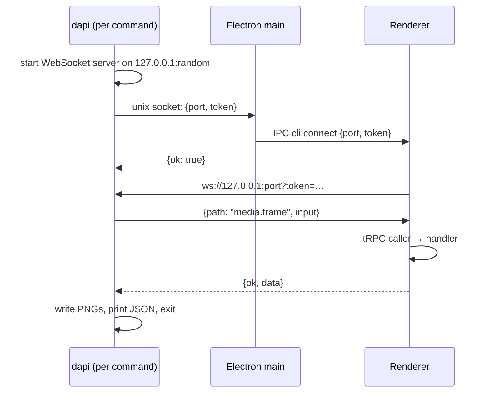

# Design: an MCP server in the app, with the CLI as its client

| | |
| --- | --- |
| Status | Proposal |
| Branch | `mcp-support` |
| Date | 2026-09-02 |
| Scope | `apps/desktop`, `apps/web`, `apps/cli`, a new `packages/dapi`, the editor skill and `reference/` |

## Summary

Today every `dapi` command is a client of nothing and a server of something: the CLI process opens its own WebSocket server, asks the Electron main process over a unix socket to tell the renderer about it, and the renderer dials back and answers one tRPC call. This document proposes the ordinary direction instead. The app hosts one persistent [MCP](https://modelcontextprotocol.io) server in the Electron main process. Agents connect to it directly. The `dapi` binary shrinks to a launcher, a stdio-to-socket pipe for agents, and a thin human-facing client. The tool handlers stay exactly where they are, in the renderer, because that is where the project world, the engine, WebCodecs and WebGPU live.

The point is not MCP for its own sake. The point is that the API gets one definition instead of three, the app becomes reachable without an admin-prompt install step, long operations get progress and cancellation, and the CLI stops needing to match the app's version.

## Goals

- One definition of the API: tool names, input schemas, descriptions and result shapes, owned by the app and served to clients at runtime.
- Agents reach the app with a one-line registration and no PATH install.
- Long operations (export, generation, `listen`) report progress and can be cancelled, without client-side timeouts.
- The CLI binary stays useful for humans, scripts and CI, and no longer has to be built against a specific router type.
- Keep the renderer handlers and their behaviour. This is a transport and surface change, not a rewrite of `capture`, `check`, `export` or the media handlers.

## Non-goals

- A network-reachable server. Everything stays on the local machine, for the local user.
- Changing the web (browser-only) app. It has no `window.desktop` and no CLI today; that stays true.
- Moving media decoding or rendering into the main process.
- Multi-window routing. One window answers, as today.

## The system today



The pieces, for reference:

- `apps/cli/src/cli-client.ts` hosts the per-command WebSocket server and wraps it in a tRPC link typed against `AppRouter` from `apps/web`.
- `apps/cli/src/index.ts` is a commander program: every command re-describes its arguments and options in help text, validates them, calls the typed client, and formats the result.
- `apps/cli/src/cli-channels.ts` hand-writes the wire types for every request and result.
- `apps/desktop/src/cli-server.ts` listens on `SOCKET_PATH`, waits for the renderer to finish loading, relays the handshake, and switches the app into headless mode on the first connection.
- `apps/web/src/lib/ipc.ts` (`CliBridge`) receives the handshake, dials the CLI, dispatches one request to whichever registered router owns the path, and holds requests that arrive while no router is mounted.
- `apps/web/src/context/dapi/api.tsx` builds the tRPC router over the handlers in the same folder. Inputs are cast, not validated (`apps/web/src/lib/cli-rpc.ts`).

### What is wrong with it

1. **The direction is inverted.** The client hosts the server. That forces the three-hop handshake, a random port, a token to guard it, and a fresh server per call. Main exists in the path only to pass along a port number.
2. **Three descriptions of one API.** Commander help text, the tRPC router's inferred types, and the hand-written wire types all describe the same procedures and can drift. The editor skill tells agents to treat `dapi --help` as authoritative, so the help text is effectively the public schema, maintained by hand.
3. **Version coupling.** The CLI is compiled against one `AppRouter`. A CLI symlinked from a different app build than the one running is silently wrong at the type level and possibly at runtime. The wire has no runtime validation.
4. **No progress, no cancellation.** The client picks a timeout per call (60 s, 10 min for generation, 1 h for export) and there is no way to stop an export once started.
5. **Install friction.** Nothing works until `/usr/local/bin/dapi` exists, which needs the macOS admin prompt in `apps/desktop/src/cli-install.ts`. Every agent session begins by checking that.
6. **Local commands live in the wrong process.** `fonts`, `fetch` (yt-dlp) and `report` run in the CLI process and are unavailable to anything that is not the CLI.

## Proposed architecture

```mermaid
sequenceDiagram
    participant Agent as Agent (Claude Code, …)
    participant Proxy as dapi mcp (stdio pipe)
    participant Main as Electron main: MCP server
    participant R as Renderer: tool handlers
    Agent->>Proxy: spawn; JSON-RPC over stdio
    Proxy->>Main: connect unix socket (launch app if absent)
    Proxy->>Main: bytes, unchanged
    Main->>Main: initialize, tools/list from catalog
    Agent->>Main: tools/call capture {id, times}
    Main->>R: IPC dapi:call {callId, tool, input}
    R-->>Main: IPC dapi:progress {callId, …} (optional)
    R-->>Main: IPC dapi:reply {callId, ok, data}
    Main->>Main: write PNGs, build content blocks
    Main-->>Agent: result {content, structuredContent}
```

Four parts.

### 1. `packages/dapi`: the tool catalog

A new workspace package, `@diffusionstudio/dapi`, that main, the renderer and the CLI all import. It replaces `apps/cli/src/cli-channels.ts` and the `./protocol` and `./channels` exports of the CLI package.

It exports one catalog: for every tool, its name, description, a zod input schema, a zod output schema for the structured result, and where it runs (`renderer` or `main`). The descriptions are the text agents read in `tools/list`, so the long, careful command descriptions currently in `apps/cli/src/index.ts` move here verbatim. The package's main export is free of Node built-ins so the renderer can import it; the `SOCKET_PATH` constant sits behind `@diffusionstudio/dapi/socket`. The IPC envelope types for the main-to-renderer call channel join the package in step 3, when something uses them.

zod is already a dependency of `apps/web`, and the MCP TypeScript SDK takes zod schemas directly, so there is no separate JSON Schema to maintain.

Tools, mapped from today's commands:

| Tool | Today | Runs in | Notes |
| --- | --- | --- | --- |
| `open` | `dapi open <dir>` | renderer | Opens or creates a project and navigates to it. Launching the app is the proxy's job, see part 3. |
| `context` | `dapi context` | renderer | |
| `capture` | `dapi capture` | renderer | Result handling in part 2. |
| `check` | `dapi check` | renderer | |
| `export` | `dapi export` | renderer | Progress and cancellation. |
| `models`, `voices`, `whoami` | same | renderer | |
| `logs` | `dapi logs` | main | Main owns the log buffer already; the renderer handler only forwards to it. |
| `screenshot` | `dapi screenshot` | renderer | |
| `media_probe`, `media_grab`, `media_transcribe`, `media_filmstrip`, `media_waveform`, `media_listen` | `dapi media …` | renderer | `grab` keeps its frame cap and `uncapped` flag as inputs. |
| `fonts` | `dapi fonts` | main | Moves from the CLI process to main. Same code. |
| `fetch` | `dapi fetch` | main | yt-dlp passthrough. Progress goes to MCP progress notifications instead of inherited stderr. |
| `report` | `dapi report` | main | Files the GitHub issue with diagnostics that main already holds. |

Argument parsing that exists today only to turn strings into numbers (`--time "45f"`, `--count`, `--per-sheet`) becomes schema: times are accepted as the same strings and parsed by `parseTime` from `@diffusionstudio/jsx` inside the schema's transform, so the CLI and the agent get identical validation and identical error messages.

### 2. Main process: the server

`apps/desktop/src/cli-server.ts` is replaced by `mcp-server.ts`. It still listens on `SOCKET_PATH` (`/tmp/diffusion-studio.sock` on macOS and Linux, `\\.\pipe\diffusion-studio` on Windows), still cleans up a stale socket file on start, and still enables headless mode on the first connection. What changes is what it speaks.

**Framing.** Each accepted socket carries newline-delimited JSON-RPC, exactly the MCP stdio framing. The SDK exports the `ReadBuffer` and `serializeMessage` helpers used by its stdio transport, so the socket transport is a short class around them. One `McpServer` instance per connection, because the SDK binds one server to one transport. Several agents can be connected at once; each gets its own session.

**Authentication.** None beyond the socket. On macOS the socket lives in the per-user temp directory; on Linux `/tmp` is shared, so the file is created with mode `0600`. The token that guards today's WebSocket server exists only because that server listens on TCP; it is not needed.

**Registration.** On startup main iterates the catalog and calls `registerTool` for each entry. A `main` tool calls its handler directly. A `renderer` tool forwards:

```ts
// apps/desktop/src/mcp-server.ts, sketch
for (const tool of catalog) {
  server.registerTool(tool.name, {
    description: tool.description,
    inputSchema: tool.input,
    outputSchema: tool.output,
  }, async (input, extra) => {
    const data = tool.runsIn === "main"
      ? await mainHandlers[tool.name](input, extra)
      : await callRenderer(tool.name, input, extra); // IPC, below
    return present(tool, data); // content + structuredContent
  });
}
```

**Main-to-renderer calls.** The current bridge (`apps/desktop/src/main-manager.ts` and `MainBridge` in `apps/web/src/lib/ipc.ts`) carries requests from the renderer to main and events from main to the renderer. It has no request in the other direction, so this adds one, with three IPC messages:

- `dapi:call` from main: `{ callId, tool, input }`
- `dapi:progress` from renderer: `{ callId, progress, total?, message? }`
- `dapi:reply` from renderer: `{ callId, ok, data | error }`
- `dapi:cancel` from main: `{ callId }`

Main keeps a map of in-flight calls. Before sending it waits for the renderer to finish loading, which `waitForRendererReady` already does. In the renderer, `CliBridge` loses its WebSocket code and keeps its dispatch and hold-until-a-handler-registers logic, now fed by `dapi:call`. The renderer registers a plain `Record<toolName, handler>` instead of a tRPC router; each handler receives the already-validated input, an `AbortSignal`, and a `report(progress)` callback. tRPC and its `cli-rpc.ts` helpers go away.

**Progress and cancellation.** When the client passes a `progressToken`, main turns `dapi:progress` into `notifications/progress`. When the client sends `notifications/cancelled`, main sends `dapi:cancel` and the handler's `AbortSignal` fires. Client-side timeouts disappear; the client decides how long it is willing to wait. `export` reports encoded frames; `media_listen` and generation-backed work report whatever stage they are in; the others report nothing and that is fine.

**Results.** Every tool returns `structuredContent` matching its output schema, plus a text block with the same JSON so clients that ignore structured content still get it. Tools that produce images (`capture`, `media_grab`, `media_filmstrip`, `media_waveform`, `screenshot`) keep today's behaviour of writing PNGs to an output directory (an `output` input, defaulting to a fresh directory under the temp dir) and returning the paths. In addition, they inline `image` content blocks when the result is small: at most four images and none over about a megabyte. A contact sheet of a few positions therefore arrives in the agent's context immediately, while an uncapped hundred-frame grab arrives as a directory the agent reads selectively, which is the behaviour the current CLI was designed for.

This does mean main sees payloads, which the current design deliberately avoids. The cost is one structured-clone copy over Electron IPC per call. Frame data crosses as `Uint8Array` rather than base64 strings to keep that copy cheap; base64 encoding happens once, in main, only for the blocks that are inlined.

**Resources.** Two things agents poll today are better as MCP resources: `dapi://context` (what `context` returns, so a client can subscribe to changes) and `dapi://logs`. The per-project authoring reference the app writes into each project, which `AGENTS.md` points at, can be listed as a resource too, so an agent can read it without knowing the path. None of this is required for the cut-over; it is listed because it is cheap once the server exists.

### 3. The `dapi` binary

`apps/cli` stays, and stays bundled with the app, but its job changes.

**`dapi mcp`** is the entry point agents register. It is a byte pipe: `process.stdin` to the socket, the socket to `process.stdout`, no JSON parsing. If the socket is absent or refused and the platform is macOS, it launches the app in the background with `open -g -a "Diffusion Studio" --args --hidden`, then retries the connection for up to 30 s, which is the existing `launchApp` and `waitForCliSocket` logic. The proxy needs no SDK dependency, and because it never interprets messages, any app version works with any proxy version. Registration is one line:

```bash
claude mcp add dapi -- dapi mcp
```

or the equivalent `.mcp.json` entry. Because the app bundle ships the binary at a known path under `Contents/Resources/cli/bin/dapi`, the app can also offer that registration itself in place of today's "install CLI" button, without a PATH symlink and without the admin prompt. The symlink install stays available for people who want `dapi` in a shell.

**`dapi open [dir]`** keeps its meaning: launch or surface the app, then call the `open` tool.

**`dapi call <tool> [--json '{…}']`** is the generic client for scripts and debugging. It uses the SDK client over the socket, prints `structuredContent` as JSON on stdout, and writes any inlined images to disk.

**Named wrappers** survive for the commands people type by hand in a shell or in CI: `capture`, `check`, `export`, `context`, `media probe`, `media grab`, at least. They are thin: they build the input object and call `call`. Their help text is generated from the catalog's descriptions, so `dapi <cmd> --help` and `tools/list` say the same thing because they are the same string. Commands nobody types by hand (`voices`, `models`, `whoami`, `screenshot`, `logs`) are reachable through `call` and need no wrapper unless one is missed.

Removed from the CLI package: `cli-client.ts`, `cli-channels.ts`, the tRPC and `ws` dependencies, and `fonts.ts`, `ytdlp.ts` and `report.ts`, which move to main.

### 4. Skill and reference docs

`apps/desktop/skills/editor/SKILL.md` currently says the CLI is self-describing via `--help`. It changes to name the MCP tools and to say that `tools/list` is authoritative, with a short fallback paragraph for environments without MCP (use `dapi call`). The per-command files in `reference/` become per-tool, and their option tables are generated from the catalog so they cannot drift either. `reference/README.md` loses the sentence about "every command talks to the running app over a local socket" and gains one about the server.

## Behaviour that must not change

- **Headless mode** switches on at the first connection, as now.
- **Requests during a project switch** are held and answered once the editor remounts. The queue moves from the renderer's `CliBridge` to being fed by IPC, but the semantics stay.
- **Asset resolution** for `media_*` tools keeps the rule in `createAssetResolver`: library paths need an open project, absolute paths and URLs work without one.
- **Sign-in gating** for `media_listen` and generation stays in the handler.
- **Error text.** Handlers throw with messages written for an agent to read (`No project open — run open first`). Main returns those as `isError` tool results, not JSON-RPC errors, so the agent sees the sentence.

## Migration

The CLI ships inside the app bundle, so there is no compatibility window to maintain between old CLIs and new apps. This can land as one feature branch in ordered steps, each of which builds and type-checks on its own.

1. **Catalog.** Create `packages/dapi` with the tool catalog, `Time`, and `DapiError`, plus tests. Point the renderer handlers' request and result types at it. Delete `apps/cli/src/cli-channels.ts`; `apps/cli/src/protocol.ts` keeps only the handshake and envelope types of the current transport. No behaviour change. *Landed on `mcp-support`.*
2. **Renderer.** Replace the tRPC router in `api.tsx` with one handler per tool behind a uniform `(args, ctx)` signature, validated by the catalog schemas, with an `AbortSignal` per call. Handlers return bytes; the WebSocket transport carries them as tagged base64 until step 3 replaces it. The CLI drops tRPC for a typed `call(name, input)` over the same catalog, so it keeps working at every step and its import of `apps/web` is gone. Progress reporting waits for step 3, with the transport that carries it. *Landed on `mcp-support`.*
3. **Main.** Add `mcp-server.ts` with the socket transport, catalog registration, the in-flight map, result presentation, and the `logs`, `fonts`, `fetch` and `report` handlers. Delete `cli-server.ts`. Verify with the MCP Inspector against the socket.
4. **CLI.** Rewrite `apps/cli` as `mcp`, `open`, `call` and the wrappers. Drop tRPC and `ws`. Update `cli-install.ts` and the settings UI to offer MCP registration.
5. **Docs.** Update the skill and regenerate `reference/`. Update the installation reference the skill points to.
6. **Cleanup.** Remove `CLI_WIRE`, the handshake types, and the `./protocol` and `./channels` exports from the CLI package.

## Open questions

- **Inline image thresholds.** Four images and about a megabyte each is a starting point. It should be tuned against what a contact sheet at the default sizes actually weighs.
- **Windows launch.** `open -a` is macOS-only today and the proposal keeps that. Windows and Linux users get a clear "launch the app first" error, as they do now. Worth fixing, not in scope here.
- **HTTP transport later.** Streamable HTTP on loopback would let clients that cannot spawn a process connect. It needs a discovery file for the port and brings back the token. Not needed while every client we care about can run `dapi mcp`.
- **Should `open` launch the app?** The tool cannot launch its own host, so launching stays in the proxy. The alternative, a separate tiny launcher binary, adds a second thing to install for no gain.
- **Concurrency limits.** Today two `dapi` processes can run two captures at once and the renderer copes. With one server that is unchanged, but it becomes easy for an agent to fire several exports in parallel. A per-tool concurrency cap in main is cheap if it turns out to matter.

## Alternatives considered

**Keep tRPC, invert the transport, add `dapi mcp` as a wrapper.** Main hosts a persistent WebSocket server speaking the current envelope; the CLI adds a stdio MCP server that wraps the existing typed client. Least code changed, and it fixes the inverted direction. It keeps the three API descriptions and adds a fourth (the MCP tool schemas in the CLI), and the CLI stays version-coupled to the app. Rejected for that reason.

**MCP over Streamable HTTP only.** Standard, works for clients that cannot spawn processes, and the SDK ships the transport. It needs a fixed or discovered port, a token, and CORS thinking. The socket transport is smaller and the proxy covers every current client; HTTP can be added beside it later.

**Run the MCP server in the renderer.** Keeps main out of the payload path. The renderer cannot listen on a socket, so main would have to be a byte pipe into the page, and progress, cancellation and the hold-until-ready queue would all live in page code that reloads on project switch. The main-process server is simpler and more robust.
